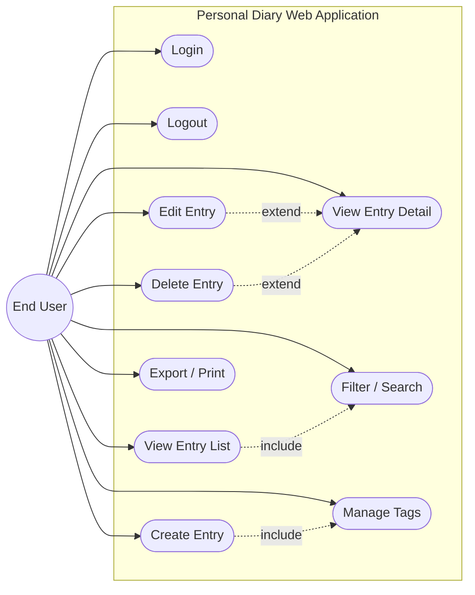
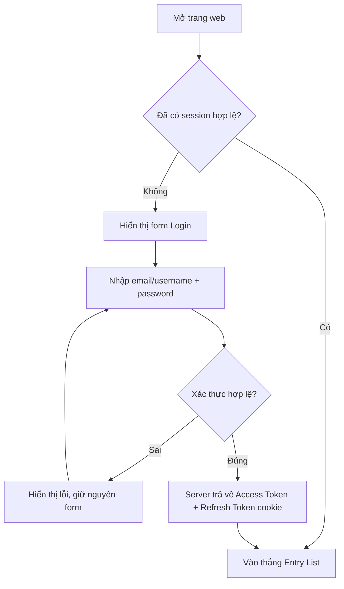
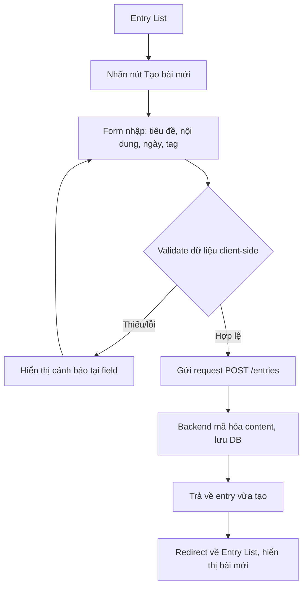
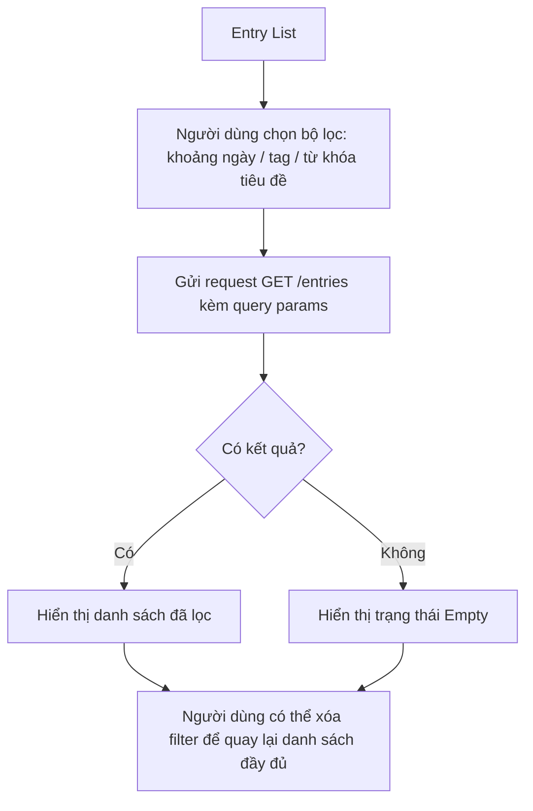
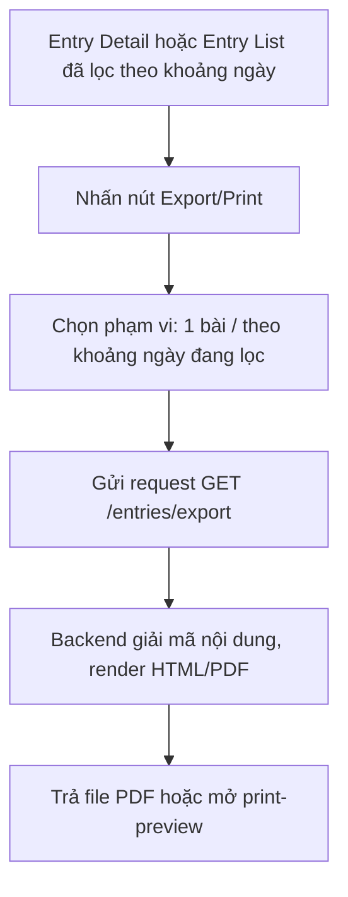
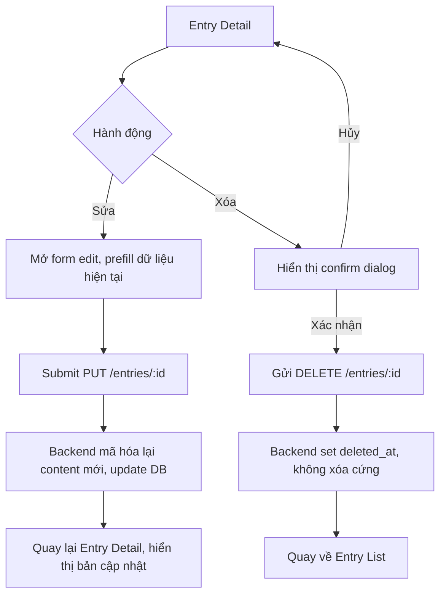

# Use Case & User Flow Specification
## Dự án: Personal Diary Web Application

**Phiên bản:** 1.0

---

## 1. Danh sách Use Case

| ID | Use Case | Actor | Mô tả ngắn |
|---|---|---|---|
| UC01 | Login | End User | Đăng nhập vào hệ thống bằng username/email + password |
| UC02 | Logout | End User | Đăng xuất, hủy phiên làm việc |
| UC03 | Create Diary Entry | End User | Tạo bài viết mới, có thể gắn tag |
| UC04 | View Entry List | End User | Xem danh sách bài viết, phân trang |
| UC05 | View Entry Detail | End User | Xem chi tiết một bài viết |
| UC06 | Edit Entry | End User | Chỉnh sửa bài viết đã tạo |
| UC07 | Delete Entry | End User | Xóa (soft delete) một bài viết |
| UC08 | Filter/Search Entries | End User | Lọc theo ngày, tag, hoặc tìm theo tiêu đề |
| UC09 | Manage Tags | End User | Tạo tag mới, gắn/gỡ tag khỏi bài viết |
| UC10 | Export/Print Entry | End User | Xuất một bài hoặc khoảng thời gian ra bản in/PDF |
| UC11 | Refresh Token | System | Tự động cấp lại access token khi hết hạn (không cần thao tác thủ công của user) |

---

## 2. Use Case Diagram

**Ghi chú quan hệ:**
- `UC03 include UC09`: tạo bài viết luôn đi kèm khả năng gắn tag.
- `UC04 include UC08`: màn hình danh sách tích hợp sẵn thanh filter/search.
- `UC06/UC07 extend UC05`: sửa/xóa được thực hiện từ màn hình chi tiết bài viết.

---

## 3. User Flow chi tiết theo kịch bản chính

### 3.1 Flow: Đăng nhập

### 3.2 Flow: Tạo bài viết mới

### 3.3 Flow: Tìm kiếm / Lọc bài viết

### 3.4 Flow: Xuất bản in

### 3.5 Flow: Sửa / Xóa bài viết

---

## 4. Ghi chú cho giai đoạn tiếp theo

Các use case và flow trên là cơ sở trực tiếp để:
- Thiết kế **API endpoints** (mỗi flow tương ứng 1–2 endpoint).
- Thiết kế **ERD**: các thực thể `User`, `DiaryEntry`, `Tag`, `EntryTag` (bảng trung gian) đã lộ rõ qua UC03/UC09.
- Thiết kế **Architecture Diagram**: điểm cần lưu ý là bước mã hóa/giải mã content nằm ở tầng Service, không lộ ra Controller hay client.

---

*Bước 2/6 trong quy trình: ~~Requirements~~ → ~~Use Case/User Flow~~ → Architecture Diagram → ERD/Schema Design → API Design → Wireframe.*
