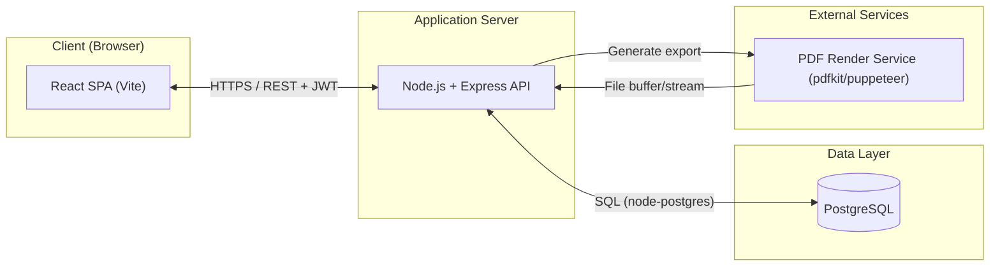
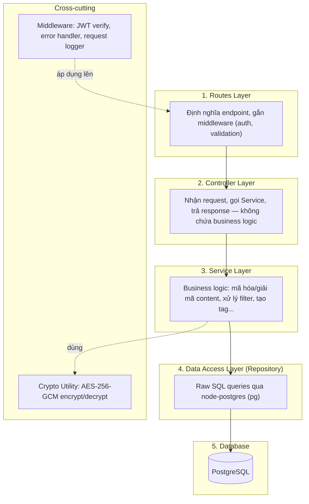
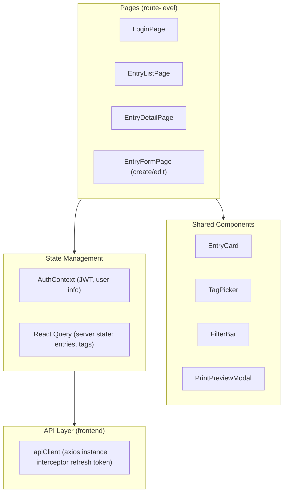
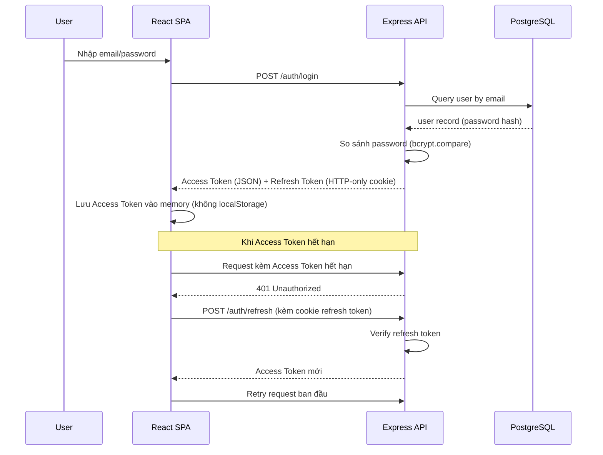
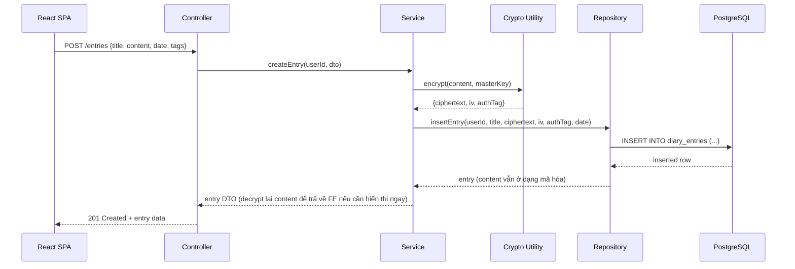
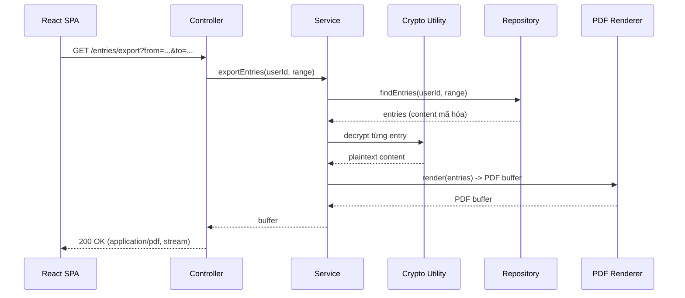
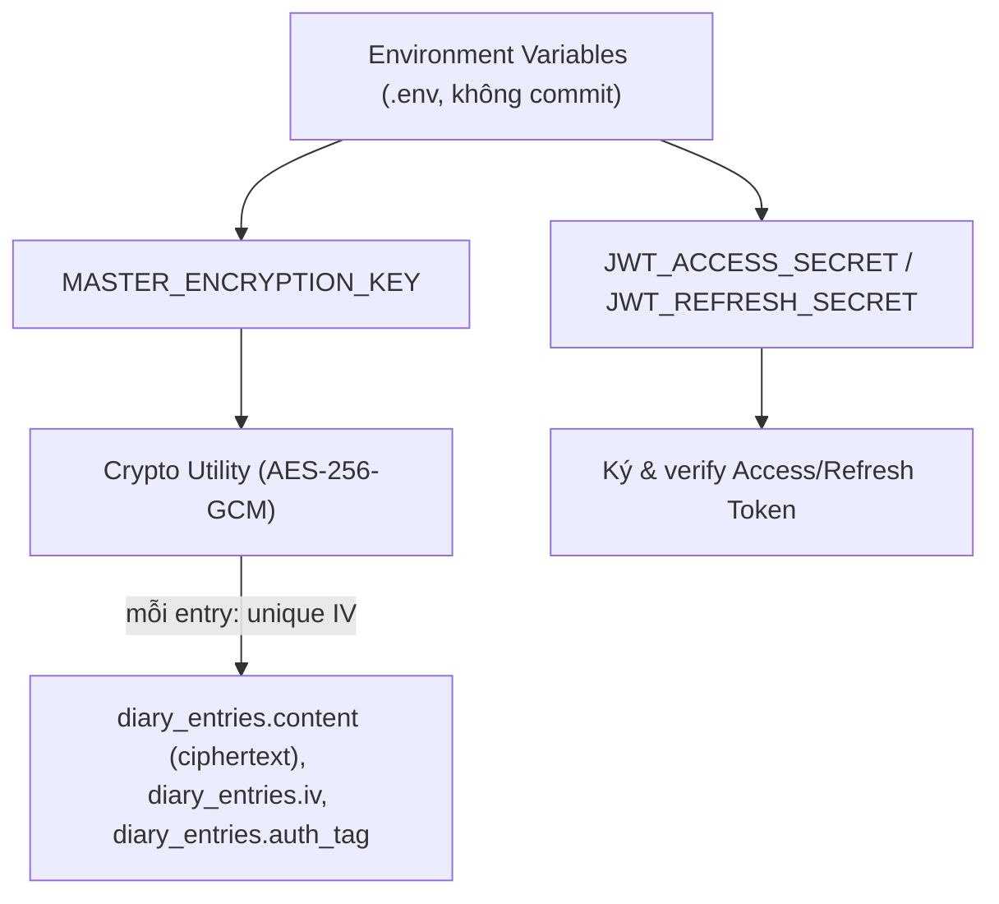
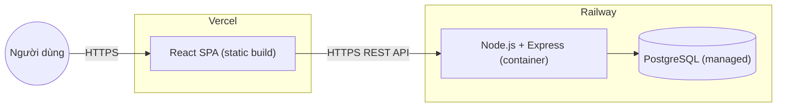

# System Architecture Document
## Dự án: Personal Diary Web Application

**Phiên bản:** 1.0
---

## 1. Kiến trúc tổng thể (Architectural Style)

Hệ thống áp dụng mô hình **Client-Server, kiến trúc Monolith phân lớp (Layered Monolithic Architecture)** cho backend, kết hợp **SPA (Single Page Application)** cho frontend. Lựa chọn này phù hợp với quy mô dự án (traffic thấp, đội ngũ phát triển nhỏ) — ưu tiên đơn giản, dễ triển khai, dễ bảo trì hơn là microservices (vốn không cần thiết ở quy mô này).



**Giải thích:**
- Client giao tiếp với server hoàn toàn qua REST API, xác thực bằng JWT — không có server-side rendering, không có session cookie chứa state (trừ refresh token cookie).
- PDF Render nằm cùng process với API (không phải service tách biệt) — vẽ riêng ra sơ đồ để làm rõ trách nhiệm, không phải để gợi ý tách microservice.

---

## 2. Kiến trúc Backend (Layered Architecture)



**Trách nhiệm từng layer:**

| Layer | Trách nhiệm | Không được làm |
|---|---|---|
| Routes | Khai báo path, method, gắn middleware theo thứ tự (auth → validate → controller) | Không chứa logic xử lý |
| Controller | Parse request, gọi service tương ứng, format response (status code, JSON shape) | Không viết SQL, không encrypt/decrypt trực tiếp |
| Service | Toàn bộ business rule: soft delete, filter theo ngày/tag, gọi crypto utility trước khi lưu/sau khi đọc | Không tự ý truy vấn DB (phải qua Repository) |
| Repository | Chỉ chứa câu SQL và mapping kết quả sang object | Không chứa business logic (vd không tự quyết định soft-delete hay hard-delete) |
| Crypto Utility | Encrypt/decrypt content bằng khóa từ biến môi trường | Không được gọi trực tiếp từ Controller hay Route |

> Nguyên tắc quan trọng nhất trong kiến trúc này: **content chỉ tồn tại ở dạng plaintext trong bộ nhớ của Service layer**, không bao giờ đi qua Controller ở dạng chưa mã hóa khi ghi, và không bao giờ đi qua Repository ở dạng đã giải mã.

---

## 3. Kiến trúc Frontend



**Quyết định kiến trúc frontend:**
- **React Query** (hoặc SWR) cho server state (danh sách entries, tags) — tránh tự quản lý loading/error state thủ công, đồng thời cache và refetch tự động khi filter thay đổi.
- **AuthContext** (React Context + useReducer) đủ dùng cho state auth đơn giản — không cần Redux ở quy mô này.
- **Axios interceptor**: tự động đính JWT vào header, tự động gọi refresh token khi access token hết hạn (401), tránh phải xử lý logic này rải rác ở từng page.

---

## 4. Sequence Diagram — các luồng quan trọng

### 4.1 Luồng xác thực (Login + Refresh Token)



**Lưu ý bảo mật:** Access token lưu ở memory (biến JS), không lưu localStorage — giảm rủi ro XSS đánh cắp token. Refresh token nằm ở HTTP-only cookie nên JS phía client không đọc được — giảm rủi ro tương tự.

### 4.2 Luồng tạo bài viết (có mã hóa)



### 4.3 Luồng export/print



---

## 5. Kiến trúc bảo mật (Security Architecture)



**Các quyết định bảo mật cốt lõi:**
1. **Một master key** cho toàn hệ thống (lưu ở env, tách biệt khỏi code và DB backup) — mỗi bản ghi có **IV (Initialization Vector) riêng, sinh ngẫu nhiên**, đảm bảo cùng nội dung mã hóa nhiều lần vẫn ra ciphertext khác nhau.
2. **AES-256-GCM** được chọn vì đây là authenticated encryption — vừa mã hóa vừa tạo `auth_tag` để phát hiện dữ liệu bị chỉnh sửa trái phép.
3. **JWT access/refresh dùng 2 secret riêng biệt** — hạn chế rủi ro nếu 1 secret bị lộ.
4. **Password hashing** (bcrypt/argon2) hoàn toàn tách biệt với encryption key của content — hai cơ chế phục vụ hai mục đích khác nhau (xác thực vs bảo mật dữ liệu), không dùng chung key.

---

## 6. Kiến trúc triển khai (Deployment Architecture)



**Ghi chú triển khai:**
- Frontend build tĩnh (Vite build → HTML/CSS/JS), deploy lên Vercel — tận dụng CDN, không cần server riêng cho frontend.
- Backend + DB cùng nằm trên Railway để giảm độ trễ mạng giữa API và DB (cùng network nội bộ của Railway).
- Biến môi trường (`MASTER_ENCRYPTION_KEY`, `JWT_ACCESS_SECRET`, `JWT_REFRESH_SECRET`, `DATABASE_URL`) cấu hình qua dashboard Railway, không hardcode, không commit vào git.
- CORS trên backend chỉ cho phép origin là domain Vercel của frontend.

---

## 7. Cấu trúc thư mục đề xuất

### Backend
```
backend/
├── src/
│   ├── routes/
│   │   ├── auth.routes.js
│   │   └── entries.routes.js
│   ├── controllers/
│   │   ├── auth.controller.js
│   │   └── entries.controller.js
│   ├── services/
│   │   ├── auth.service.js
│   │   └── entries.service.js
│   ├── repositories/
│   │   ├── user.repository.js
│   │   └── entry.repository.js
│   ├── middlewares/
│   │   ├── authenticate.js
│   │   ├── errorHandler.js
│   │   └── validate.js
│   ├── utils/
│   │   ├── crypto.js
│   │   └── pdfRenderer.js
│   ├── db/
│   │   ├── pool.js
│   │   └── migrations/
│   └── app.js
├── .env
└── package.json
```

### Frontend
```
frontend/
├── src/
│   ├── pages/
│   │   ├── LoginPage.tsx
│   │   ├── EntryListPage.tsx
│   │   ├── EntryDetailPage.tsx
│   │   └── EntryFormPage.tsx
│   ├── components/
│   │   ├── EntryCard.tsx
│   │   ├── TagPicker.tsx
│   │   ├── FilterBar.tsx
│   │   └── PrintPreviewModal.tsx
│   ├── context/
│   │   └── AuthContext.tsx
│   ├── services/
│   │   └── apiClient.ts
│   ├── hooks/
│   │   └── useEntries.ts
│   └── main.tsx
└── package.json
```

---

## 8. Bảng tổng hợp công nghệ

| Thành phần | Công nghệ | Lý do |
|---|---|---|
| Frontend build tool | Vite | Build/dev nhanh, cấu hình tối giản |
| Frontend framework | React | Đáp ứng mục tiêu học tập, hệ sinh thái lớn |
| Styling | Tailwind CSS | Tốc độ phát triển UI nhanh |
| Server state (FE) | React Query | Cache, tự động refetch, giảm code thủ công |
| Backend runtime | Node.js + Express | Đơn giản, phù hợp mục tiêu học Node.js nền tảng |
| Database | PostgreSQL | Quan hệ rõ ràng, hỗ trợ tốt cho thiết kế schema thủ công |
| DB driver | node-postgres (pg) | Raw SQL, kiểm soát hoàn toàn schema/query |
| Auth | JWT (access + refresh) | Stateless, phù hợp kiến trúc REST |
| Encryption | AES-256-GCM (Node `crypto` module) | Authenticated encryption, không cần thư viện ngoài |
| PDF export | pdfkit hoặc puppeteer | Kiểm soát định dạng bản in, hỗ trợ tiếng Việt có dấu |
| Deploy FE | Vercel | Free-tier, tối ưu cho SPA/static |
| Deploy BE + DB | Railway | Free-tier, hỗ trợ Postgres managed sẵn |

---

## 9. Bước tiếp theo

Kiến trúc ở tài liệu này là cơ sở trực tiếp để thiết kế:
- **ERD/Schema** (bước 4): các bảng `users`, `diary_entries` (kèm `content_ciphertext`, `iv`, `auth_tag`), `tags`, `entry_tags`.
- **API Design** (bước 5): endpoint list bám theo Controller layer đã định nghĩa ở mục 2.

---

*Bước 3/6 trong quy trình: ~~Requirements~~ → ~~Use Case/User Flow~~ → ~~Architecture Diagram~~ → ERD/Schema Design → API Design → Wireframe.*
