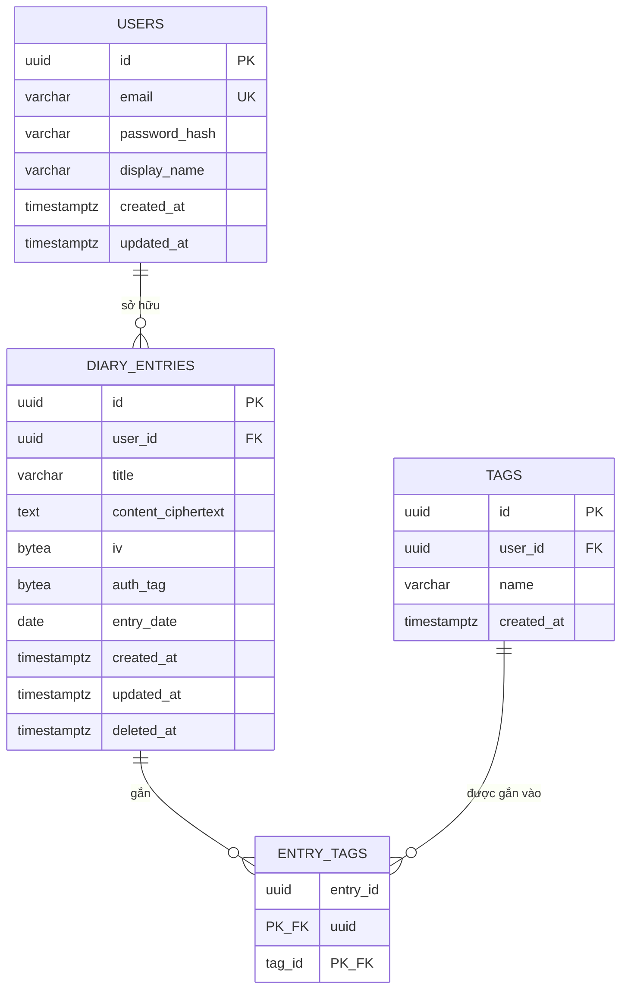

# Database Design Document (ERD & Schema)
## Dự án: Personal Diary Web Application

**Phiên bản:** 1.0
---

## 1. Entity-Relationship Diagram



**Quan hệ:**
- `USERS 1—N DIARY_ENTRIES`: mỗi user sở hữu nhiều bài viết; mỗi bài viết thuộc về đúng 1 user.
- `DIARY_ENTRIES N—N TAGS` thông qua bảng trung gian `ENTRY_TAGS`: một bài viết có nhiều tag, một tag dùng cho nhiều bài viết.
- `TAGS` cũng thuộc về `user_id` riêng — tag của user này không lẫn với user khác (tránh trường hợp user A xóa tag ảnh hưởng dữ liệu user B).

---

## 2. Thiết kế chi tiết từng bảng

### 2.1 `users`

| Cột | Kiểu dữ liệu | Ràng buộc | Ghi chú |
|---|---|---|---|
| `id` | `UUID` | PK, default `gen_random_uuid()` | Dùng UUID thay vì auto-increment int để tránh lộ số lượng user, dễ merge dữ liệu nếu mở rộng sau |
| `email` | `VARCHAR(255)` | UNIQUE, NOT NULL | Dùng làm định danh đăng nhập |
| `password_hash` | `VARCHAR(255)` | NOT NULL | Lưu bcrypt/argon2 hash, không lưu plaintext |
| `display_name` | `VARCHAR(100)` | NULL | Tên hiển thị trên UI |
| `created_at` | `TIMESTAMPTZ` | NOT NULL, default `now()` | |
| `updated_at` | `TIMESTAMPTZ` | NOT NULL, default `now()` | Cập nhật qua trigger hoặc tại tầng Service |

### 2.2 `diary_entries`

| Cột | Kiểu dữ liệu | Ràng buộc | Ghi chú |
|---|---|---|---|
| `id` | `UUID` | PK, default `gen_random_uuid()` | |
| `user_id` | `UUID` | FK → `users.id`, NOT NULL, `ON DELETE CASCADE` | Xóa user thì xóa luôn entries (chỉ áp dụng nếu thật sự cần hard-delete user, thường không xảy ra) |
| `title` | `VARCHAR(255)` | NOT NULL | **Không mã hóa** — dùng để search full-text nhanh (xem mục 5.1 của Architecture doc) |
| `content_ciphertext` | `TEXT` | NOT NULL | Nội dung đã mã hóa (base64 hoặc hex của ciphertext AES-256-GCM) |
| `iv` | `BYTEA` | NOT NULL | Initialization Vector — sinh ngẫu nhiên riêng cho mỗi bản ghi |
| `auth_tag` | `BYTEA` | NOT NULL | Tag xác thực của AES-GCM, dùng để verify tính toàn vẹn khi giải mã |
| `entry_date` | `DATE` | NOT NULL | Ngày người dùng gắn cho bài viết (có thể khác `created_at` nếu viết bù) |
| `created_at` | `TIMESTAMPTZ` | NOT NULL, default `now()` | |
| `updated_at` | `TIMESTAMPTZ` | NOT NULL, default `now()` | |
| `deleted_at` | `TIMESTAMPTZ` | NULL | Soft delete — `NULL` nghĩa là chưa xóa |

**Index đề xuất:**
```sql
CREATE INDEX idx_entries_user_date ON diary_entries (user_id, entry_date DESC)
    WHERE deleted_at IS NULL;
CREATE INDEX idx_entries_title_trgm ON diary_entries USING gin (title gin_trgm_ops);
```
- `idx_entries_user_date`: phục vụ trực tiếp UC04 (list theo user, sort theo ngày) và UC08 (filter theo khoảng ngày) — có điều kiện `WHERE deleted_at IS NULL` để index chỉ chứa bản ghi còn hiệu lực (partial index, giảm kích thước index).
- `idx_entries_title_trgm`: dùng extension `pg_trgm` để search gần đúng (fuzzy) trên `title`, thay vì chỉ `LIKE 'prefix%'` cơ bản.

### 2.3 `tags`

| Cột | Kiểu dữ liệu | Ràng buộc | Ghi chú |
|---|---|---|---|
| `id` | `UUID` | PK, default `gen_random_uuid()` | |
| `user_id` | `UUID` | FK → `users.id`, NOT NULL, `ON DELETE CASCADE` | |
| `name` | `VARCHAR(50)` | NOT NULL | |
| `created_at` | `TIMESTAMPTZ` | NOT NULL, default `now()` | |

**Ràng buộc unique:**
```sql
ALTER TABLE tags ADD CONSTRAINT uq_tags_user_name UNIQUE (user_id, name);
```
- Đảm bảo mỗi user không tạo trùng tên tag (nhưng 2 user khác nhau có thể cùng đặt tên tag "gia đình").

### 2.4 `entry_tags` (bảng trung gian N–N)

| Cột | Kiểu dữ liệu | Ràng buộc | Ghi chú |
|---|---|---|---|
| `entry_id` | `UUID` | FK → `diary_entries.id`, `ON DELETE CASCADE` | |
| `tag_id` | `UUID` | FK → `tags.id`, `ON DELETE CASCADE` | |

```sql
ALTER TABLE entry_tags ADD PRIMARY KEY (entry_id, tag_id);
```
- Composite primary key vừa đảm bảo unique (không gắn trùng 1 tag 2 lần vào cùng 1 entry), vừa tự động tạo index phục vụ join.

---

## 3. Full DDL Script

```sql
-- Cần bật extension trước
CREATE EXTENSION IF NOT EXISTS pgcrypto;   -- cho gen_random_uuid()
CREATE EXTENSION IF NOT EXISTS pg_trgm;    -- cho fuzzy search title

CREATE TABLE users (
    id              UUID PRIMARY KEY DEFAULT gen_random_uuid(),
    email           VARCHAR(255) NOT NULL UNIQUE,
    password_hash   VARCHAR(255) NOT NULL,
    display_name    VARCHAR(100),
    created_at      TIMESTAMPTZ NOT NULL DEFAULT now(),
    updated_at      TIMESTAMPTZ NOT NULL DEFAULT now()
);

CREATE TABLE diary_entries (
    id                  UUID PRIMARY KEY DEFAULT gen_random_uuid(),
    user_id             UUID NOT NULL REFERENCES users(id) ON DELETE CASCADE,
    title               VARCHAR(255) NOT NULL,
    content_ciphertext  TEXT NOT NULL,
    iv                  BYTEA NOT NULL,
    auth_tag            BYTEA NOT NULL,
    entry_date          DATE NOT NULL,
    created_at          TIMESTAMPTZ NOT NULL DEFAULT now(),
    updated_at          TIMESTAMPTZ NOT NULL DEFAULT now(),
    deleted_at          TIMESTAMPTZ
);

CREATE INDEX idx_entries_user_date ON diary_entries (user_id, entry_date DESC)
    WHERE deleted_at IS NULL;

CREATE INDEX idx_entries_title_trgm ON diary_entries USING gin (title gin_trgm_ops);

CREATE TABLE tags (
    id          UUID PRIMARY KEY DEFAULT gen_random_uuid(),
    user_id     UUID NOT NULL REFERENCES users(id) ON DELETE CASCADE,
    name        VARCHAR(50) NOT NULL,
    created_at  TIMESTAMPTZ NOT NULL DEFAULT now(),
    CONSTRAINT uq_tags_user_name UNIQUE (user_id, name)
);

CREATE TABLE entry_tags (
    entry_id    UUID NOT NULL REFERENCES diary_entries(id) ON DELETE CASCADE,
    tag_id      UUID NOT NULL REFERENCES tags(id) ON DELETE CASCADE,
    PRIMARY KEY (entry_id, tag_id)
);
```

---

## 4. Trigger tự động cập nhật `updated_at`

Thay vì xử lý `updated_at` thủ công ở Service layer (dễ quên khi thêm field mới), dùng trigger chung cho mọi bảng cần track:

```sql
CREATE OR REPLACE FUNCTION set_updated_at()
RETURNS TRIGGER AS $$
BEGIN
    NEW.updated_at = now();
    RETURN NEW;
END;
$$ LANGUAGE plpgsql;

CREATE TRIGGER trg_users_updated_at
    BEFORE UPDATE ON users
    FOR EACH ROW EXECUTE FUNCTION set_updated_at();

CREATE TRIGGER trg_entries_updated_at
    BEFORE UPDATE ON diary_entries
    FOR EACH ROW EXECUTE FUNCTION set_updated_at();
```

---

## 5. Câu query mẫu cho các Use Case chính

### 5.1 Lấy danh sách entries theo user, filter theo ngày + tag (UC04, UC08)

```sql
SELECT DISTINCT e.id, e.title, e.entry_date, e.created_at
FROM diary_entries e
LEFT JOIN entry_tags et ON et.entry_id = e.id
LEFT JOIN tags t ON t.id = et.tag_id
WHERE e.user_id = $1
  AND e.deleted_at IS NULL
  AND ($2::date IS NULL OR e.entry_date >= $2)
  AND ($3::date IS NULL OR e.entry_date <= $3)
  AND ($4::uuid[] IS NULL OR t.id = ANY($4))
ORDER BY e.entry_date DESC
LIMIT $5 OFFSET $6;
```

### 5.2 Search theo title (fuzzy, dùng pg_trgm)

```sql
SELECT id, title, entry_date
FROM diary_entries
WHERE user_id = $1
  AND deleted_at IS NULL
  AND title % $2   -- toán tử similarity của pg_trgm
ORDER BY similarity(title, $2) DESC
LIMIT 20;
```

### 5.3 Soft delete một entry (UC07)

```sql
UPDATE diary_entries
SET deleted_at = now()
WHERE id = $1 AND user_id = $2 AND deleted_at IS NULL
RETURNING id;
```

### 5.4 Gắn tag cho entry (dùng trong UC03 — kiểm tra tag đã có, rồi liên kết)

```sql
-- Bước 1: lấy tag đã được tạo riêng bởi user
SELECT id FROM tags WHERE user_id = $1 AND id = ANY($2::uuid[]);

-- Bước 2: liên kết entry với các tag hợp lệ
INSERT INTO entry_tags (entry_id, tag_id)
SELECT $1, id FROM tags WHERE user_id = $2 AND id = ANY($3::uuid[])
ON CONFLICT DO NOTHING;
```

---

## 6. Các quyết định thiết kế đáng chú ý

1. **UUID thay vì SERIAL/BIGSERIAL cho khóa chính**: tránh lộ thông tin số lượng bản ghi qua ID tăng dần, thuận tiện nếu sau này cần merge dữ liệu giữa các môi trường (dev/staging/prod).
2. **`iv` và `auth_tag` lưu kiểu `BYTEA`, tách riêng cột thay vì nhét chung vào `content_ciphertext`**: giúp query/debug rõ ràng hơn, và đúng chuẩn khi implement AES-GCM (3 thành phần ciphertext/iv/authTag cần tách bạch để giải mã đúng).
3. **`title` không mã hóa**: đánh đổi có chủ đích — chấp nhận `title` không tuyệt đối riêng tư để đổi lấy khả năng search/index hiệu quả. Đây là quyết định cần bạn xác nhận lại vì ảnh hưởng trực tiếp đến FR6 (bảo mật nội dung) — nếu bạn muốn title cũng được mã hóa, sẽ phải bỏ index `pg_trgm` và chuyển hoàn toàn sang search kiểu "giải mã rồi lọc trong service" (chậm hơn nhưng riêng tư tuyệt đối).
4. **Soft delete bằng `deleted_at`** thay vì bảng `is_deleted BOOLEAN`: cho biết luôn thời điểm xóa, thuận tiện cho việc dọn dữ liệu định kỳ (vd cron job xóa cứng sau 30 ngày) mà không cần thêm cột.
5. **Partial index `WHERE deleted_at IS NULL`**: giữ index gọn nhẹ, vì các query thực tế hầu như luôn lọc bản ghi chưa xóa.

---

## 7. Bước tiếp theo

Schema này là cơ sở trực tiếp cho **API Design** (bước 5) — mỗi endpoint sẽ map tới đúng 1 hoặc 1 nhóm query đã liệt kê ở mục 5.

---

*Bước 4/6 trong quy trình: ~~Requirements~~ → ~~Use Case/User Flow~~ → ~~Architecture Diagram~~ → ~~ERD/Schema Design~~ → API Design → Wireframe.*
